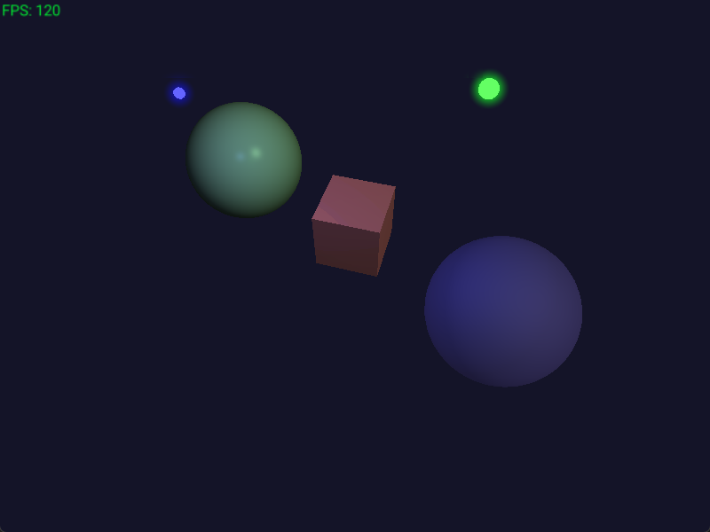

# 3D Test

Simple raylib test project (basic 3D). The main goal of this project was to implement custom shader
elements to properly emulate shade depth. This serves not only to expand my knowledge in raylib 3D
rendering, but also GLSL and graphics processing.

Includes:
- basic materials system
- basic lighting system
- basic post processing (light bloom)

## Installation (with MSYS2)
- Go through setup process to get mingw compiler working with VSCode
- Search for raylib package in mingw repository `pacman -Ss raylib`
- Copy package name that matches g++ version (default is ucrt64)
- Install package with `pacman -S {...}`
- (FYI: `-lraylib` flag was added to tasks.json manually)

## Release
- Run release.bat
- Note: needs to have raylib sources files downloaded to default location (C:/raylib/raylib/src)
- Can get raylib source code from https://www.raylib.com/